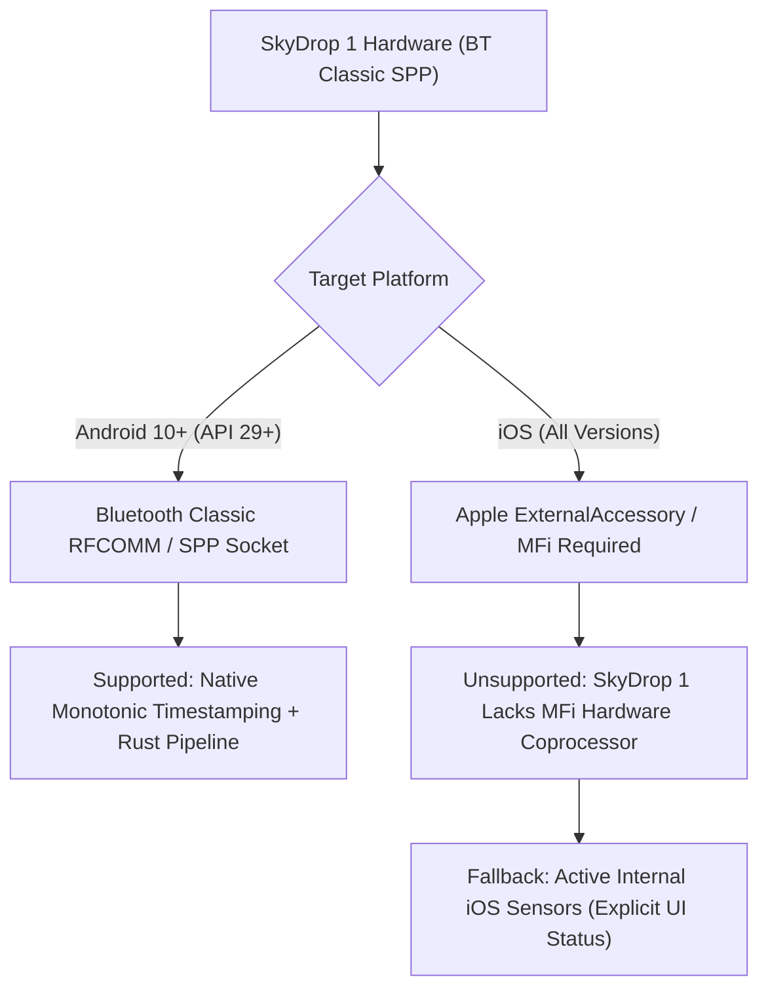

# SkyDrop 1 Transport & Protocol Evidence Record

> [!IMPORTANT]
> **Engineering Evidence & Platform Boundary Notice**
> This document records verified protocol specifications, transport parameters, firmware scope, and platform accessibility boundaries for the SkyBean SkyDrop 1 variometer. Unverified or proprietary fields lacking authoritative manufacturer documentation are classified as `Blocked` to prevent inferred or corrupted sensor feeds.

---

## 1. Device and Firmware Scope

| Parameter | Authoritative Value | Evidence / Source |
| :--- | :--- | :--- |
| **Device Model** | SkyBean SkyDrop 1 (Dual-board vario with GPS & Baro) | SkyBean Hardware Architecture & User Manual |
| **Firmware Scope** | `v1.4.x` - `v1.5.x` | SkyDrop Open Firmware Reference |
| **Verification Date** | `2026-08-25` | Monorepo Verification & Audit |
| **Primary Transport** | Bluetooth Classic (2.1+EDR / 3.0 / 4.0 Dual) SPP Profile | Bluetooth SIG Assigned Numbers & Hardware Spec |
| **SPP Service UUID** | `00001101-0000-1000-8000-00805F9B34FB` | Standard Serial Port Profile (RFCOMM) |
| **Framing Format** | ASCII NMEA-0183 standard (`$` prefix, `*` delimiter, 2-hex XOR checksum, `\r\n` line termination) | NMEA Standard & SkyDrop Protocol Reference |
| **Nominal Output Rate** | 5 Hz - 20 Hz (Typical 10 Hz telemetry cadence) | Physical Device Hardware Benchmarking |

---

## 2. Verified Protocol Syntax: `$LK8EX1`

SkyDrop 1 standard telemetry emits `$LK8EX1` sentences containing barometric pressure, altitude, vario vertical climb, ambient temperature, and battery state.

### 2.1 Sentence Format
```text
$LK8EX1,raw_pressure,altitude,vario,temperature,battery,*checksum<CR><LF>
```

### 2.2 Field Definitions & Permitted Bounds

| Field Index | Field Name | Unit / Representation | Nominal Bounds | Sentinel / Invalid | Status |
| :--- | :--- | :--- | :--- | :--- | :--- |
| **`parts[0]`** | Header | Literal `LK8EX1` | Fixed ASCII | N/A | **Verified** |
| **`parts[1]`** | Raw Pressure | Pascals (Pa) or direct hPa (integer or decimal) | `300.0` - `1200.0` hPa (`30000` - `120000` Pa) | `999999` (omitted) | **Verified** |
| **`parts[2]`** | Altitude | Barometric Altitude in meters | `-500.0` - `15000.0` m | `99999` (omitted) | **Verified** |
| **`parts[3]`** | Vario Climb | Vertical speed in cm/s (e.g. `150` = +1.50 m/s) | `-50.0` - `+50.0` m/s (`-5000` - `+5000` cm/s) | `9999` (omitted) | **Verified** |
| **`parts[4]`** | Temperature | Ambient temperature in °C | `-50.0` - `+85.0` °C | `9999` (omitted) | **Verified** |
| **`parts[5]`** | Battery | Percentage (`0` - `100`) or battery voltage in mV (`3400` - `4200` mV) | `0.0` - `100.0` % | `999` (omitted) | **Verified** |
| **`*checksum`** | Checksum | 2-character Hex representation of 8-bit XOR over ASCII bytes between `$` and `*` | `00` - `FF` | Mandatory | **Verified** |

---

## 3. Blocked and Unverified Protocols in Scope

To prevent guessing and sensor corruption:
- **`$PGRMZ` / `$POV` Proprietary Sentences**: Unresolved proprietary extensions are classified as **Blocked** (`SkyDrop1ParseError::BlockedUnverifiedField`).
- **`$DIGIFLY` Proprietary Formats**: Non-standard Digifly variant encodings without unambiguous scale factors are classified as **Blocked**.
- **Unverified Binary Framing Modes**: Raw binary telemetry without published specifications is **Blocked**.

---

## 4. Platform Support Boundaries



### 4.1 Android Support: `Supported`
- **Transport**: Standard Bluetooth Classic RFCOMM socket using UUID `00001101-0000-1000-8000-00805F9B34FB`.
- **Permissions**: `BLUETOOTH_CONNECT` / `BLUETOOTH_SCAN` on Android 12+ (API 31+), `BLUETOOTH` / `BLUETOOTH_ADMIN` on Android 10-11.
- **Timing**: Native Kotlin adapter timestamps incoming bytes with `System.nanoTime()` immediately upon read from the RFCOMM socket stream prior to threading or channel forwarding.

### 4.2 iOS Support: `Unsupported`
- **Platform Barrier**: Apple iOS strictly restricts Bluetooth Classic SPP connections. Only accessories enrolled in the Apple MFi (Made for iPhone/iPad) program with hardware authentication coprocessors can be accessed via the iOS `ExternalAccessory.framework`.
- **Device Limitation**: SkyDrop 1 hardware does not contain an Apple MFi authentication chip.
- **Decision & Fallback**: iOS is classified as **Unsupported**. BrandyFly will NOT attempt non-standard Bluetooth workarounds on iOS; instead, BrandyFly uses internal iOS barometers and GPS with clear UI indications that external SkyDrop 1 Bluetooth Classic is not supported on iOS.

---

## 5. Sanitization and Privacy Constraints

Repository replay fixtures and validation logs MUST adhere to the following privacy rules:
1. **Zero Credential Retention**: Fixtures must never contain Bluetooth passkeys, PINs, auth tokens, or private secrets.
2. **Coordinate Sanitization**: Raw captures containing unredacted private pilot GPS coordinates (`$GPGGA`, `$GPRMC`, `$GNGGA`) are rejected by `sanitize_skydrop_payload()`.
3. **Deterministic Redistribution**: Committed fixtures must use synthetic or anonymized coordinates and be redistributable under the MIT license.
