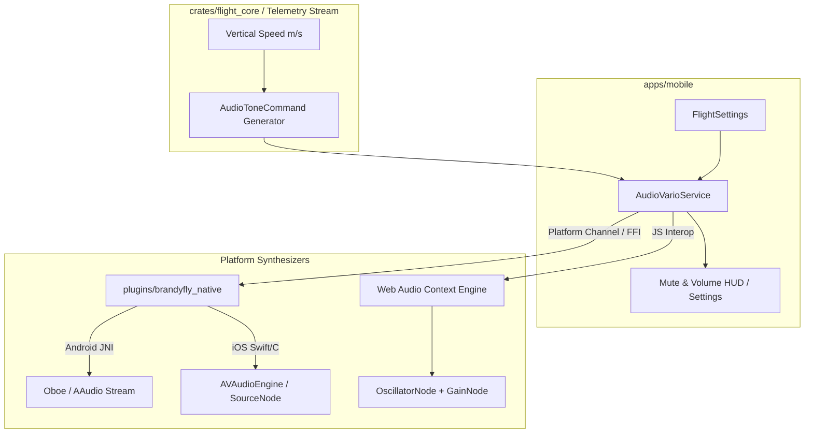

## Context

Acoustic feedback is a safety-critical flight instrument in paragliding. Pilots track lift cores and thermaling efficiency via continuous sound modulation while keeping their situational awareness focused outdoors on traffic, terrain, and wing behavior. Discrete audio sample playback systems introduce latency and audible glitching. By implementing a continuous frequency-modulated (FM) synthesizer across mobile and web platforms, BrandyFly delivers instantaneous, high-fidelity acoustic feedback.

## Goals & Non-Goals

### Goals
- Implement real-time continuous waveform audio synthesis with sub-15ms latency across Android, iOS, and Web.
- Eliminate audio sample playback glitches, looping artifacts, and click sounds using phase-continuous waveform generation and smooth gain envelopes (anti-click attack/decay ramps).
- Provide accurate mathematical mapping for lift frequency, climb beeping cadence, sink warning drone, and near-thermal sniffer tones.
- Build a unified `AudioVarioService` in `apps/mobile` that interacts cleanly with `flight_core` tone commands and user flight settings.
- Support audio mute toggles, volume scaling, customizable climb/sink thresholds, and background audio handling.

### Non-Goals
- Spoken text-to-speech audio announcements (altitude, speed, heading callouts).
- Proprietary Bluetooth vario acoustic streaming protocols.
- Polyphonic music synthesis or sound effects unrelated to flight instruments.

## Architectural Decisions

### Decision 1: Platform Synthesizer Engines in `plugins/brandyfly_native`
To achieve zero latency and glitch-free continuous audio, platform-native audio stream engines are implemented:

1. **Android (Oboe / AAudio)**:
   - Low-latency C++ audio callback stream configured with `PerformanceMode::LowLatency` and `SharingMode::Exclusive`.
   - Computes continuous sine/band-limited waveforms per audio frame directly on the high-priority real-time audio thread.
   - Controlled from Dart via platform channel / JNI with lock-free atomic parameter updates (frequency, duty cycle, period, volume, state).

2. **iOS (`AVAudioEngine` / `AVAudioSourceNode`)**:
   - High-priority real-time audio render callback generating PCM buffers on demand.
   - Anti-click envelope smoothing (1–2 ms linear attack/decay ramps on tone onsets/offsets).
   - Manages `AVAudioSession` category (`.playback` with `.mixWithOthers` option).

3. **Web (Web Audio API)**:
   - `AudioContext` with custom JavaScript bridge.
   - Continuous `OscillatorNode` (custom sine/triangle) piped through a `GainNode`.
   - Frequency and gain modulations scheduled using `setValueAtTime` and `linearRampToValueAtTime` to prevent clicks.
   - Handles browser autoplay policy by deferring `AudioContext.resume()` until the first user gesture.

4. **Linux / Desktop Fallback**:
   - Basic audio stream generator or safe stub mode ensuring desktop debugging and mock flight mode run without crashing.

### Decision 2: Frequency & Cadence Mathematical Mapping
The synthesizer translates vertical climb/sink velocity ($v$ in m/s) into audio parameters:

1. **Climb / Lift Mode ($v \ge +0.2$ m/s)**:
   - Frequency: Linear or logarithmic interpolation from $450\text{ Hz}$ at $+0.2\text{ m/s}$ to $1800\text{ Hz}$ at $+8.0\text{ m/s}$:
     $$f(v) = 450 + (v - 0.2) \cdot \left(\frac{1800 - 450}{8.0 - 0.2}\right)\quad (\text{clamped to } [450, 1800]\text{ Hz})$$
   - Pulse Rate (Cadence): Modulated from $2.0\text{ Hz}$ at $+0.2\text{ m/s}$ to $12.0\text{ Hz}$ at $+6.0\text{ m/s}$:
     $$\text{rate}(v) = 2.0 + (v - 0.2) \cdot \left(\frac{12.0 - 2.0}{6.0 - 0.2}\right)\quad (\text{clamped to } [2.0, 12.0]\text{ Hz})$$
   - Pulse Period: $T(v) = \frac{1000}{\text{rate}(v)}\text{ ms}$.
   - Duty Cycle: Dynamic ratio between $50\%$ and $60\%$ active tone duration per period with smooth 2 ms envelope attack/decay.

2. **Sink Mode ($v \le -1.5$ m/s)**:
   - Continuous tone (100% duty cycle, no pulsing).
   - Frequency decreases from $300\text{ Hz}$ at $-1.5\text{ m/s}$ down to $180\text{ Hz}$ at $-5.0\text{ m/s}$ or greater sink:
     $$f(v) = \max\left(180, 300 - (|v| - 1.5) \cdot 34.3\right)\text{ Hz}$$

3. **Near-Thermal / Sniffer Mode ($-0.3\text{ m/s} \le v \le +0.1\text{ m/s}$)**:
   - Enabled via user setting.
   - Low-volume buzzing tone: $400\text{–}450\text{ Hz}$, $1.5\text{–}2.0\text{ Hz}$ pulse rate, $15\text{–}20\%$ duty cycle, $-10\text{ dB}$ relative attenuation.

4. **Neutral Band / Silent**:
   - Output gain ramped to zero when $-1.5\text{ m/s} < v < -0.3\text{ m/s}$ (or when sniffer is disabled and $v < +0.2\text{ m/s}$).

### Decision 3: Dart Audio Vario Service Lifecycle
- `AudioVarioService` listens to the telemetry/vario stream from `FlightTrackingService`.
- Exposes `setMuted(bool)`, `setVolume(double)`, `updateSettings(FlightSettings)`.
- Handles app lifecycle events (pauses audio generation on backgrounding unless background flight recording is active).
- Anti-glitch watchdog ensures that if telemetry updates stall, audio immediately ramps to silent within 150 ms.

### Decision 4: User Configuration & Settings Persistence
- Extend `FlightSettings` with:
  - `varioAudioEnabled` (bool, default `true`)
  - `varioVolume` (double, default `0.8`)
  - `varioClimbThresholdMs` (double, default `0.2`)
  - `varioSinkThresholdMs` (double, default `-1.5`)
  - `varioSnifferEnabled` (bool, default `false`)
- Add a dedicated audio vario toggle and volume control in the UI settings panel and flight HUD.

## Risks & Trade-offs

- **Web Autoplay Restrictions**: Modern browsers block Web Audio playback prior to a user tap. Handled gracefully by listening for the initial user interaction on startup and resuming the `AudioContext`.
- **Audio Thread Overrun**: Complex audio processing can cause glitches if the audio callback misses deadlines. Handled by keeping synthesis algorithms minimal (pure phase-accumulator sine/triangle generation and lock-free atomic parameter exchanges).
- **Background Flight Audio**: Running audio in the background on mobile requires proper `AVAudioSession` configuration on iOS and foreground service audio attributes on Android.

## Migration Plan

1. Implement platform audio synthesis engines in `plugins/brandyfly_native` (Android Oboe, iOS AVAudioEngine) and Web Audio API wrapper.
2. Integrate `AudioVarioService` in `apps/mobile` with `flight_core` tone calculation logic.
3. Update `FlightSettings` and UI configuration panels to expose audio vario controls.
4. Verify performance and latency across mobile, web, and mock flight environments.
