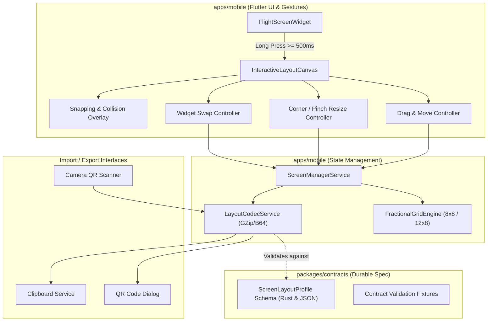

## Context & Background

Modern electronic flight instruments (variometers and flight computers) require adaptable user interfaces that can be customized to pilot preferences, cockpit mounting geometry (flight deck angle, portrait phone vs landscape tablet), and flight disciplines (XC thermaling vs competition speed-runs). BrandyFly's mobile application (`apps/mobile`) uses Flutter with a reactive `ScreenManagerService`. Currently, widget positioning uses fixed basic coordinates that lack visual dragging, interactive resizing, collision feedback, and cross-pilot layout sharing.

This design introduces a formal fractional grid layout engine, a direct-manipulation edit canvas with gesture handles, an authoritative layout schema in `packages/contracts`, and QR code / clipboard sharing capabilities.

## Goals & Non-Goals

### Goals
- Implement a responsive fractional grid system (8x8 portrait, 12x8 landscape) with minimum widget size enforcement.
- Provide a smooth, gesture-driven edit mode (long-press activation, drag-to-move, corner-drag/pinch resizing, and swap handles) with visual snapping and collision feedback.
- Define a canonical Rust + JSON schema contract in `packages/contracts` for screen layout profiles.
- Enable offline peer-to-peer screen layout sharing via compressed QR codes and clipboard copy/paste.

### Non-Goals
- Cloud database layout sync or remote user account dependencies (purely offline-first).
- Free-angle widget rotation or non-rectangular widget bounding boxes.

## Architectural Decisions



### Decision 1: Fractional Grid Geometry & Coordinate Mapping
The screen canvas is partitioned into integer cell units:
- **Portrait**: $N_{\text{cols}} = 8, N_{\text{rows}} = 8$. Cell width $w_c = \frac{W_{\text{viewport}}}{8}$, cell height $h_c = \frac{H_{\text{viewport}}}{8}$.
- **Landscape / Tablet**: $N_{\text{cols}} = 12, N_{\text{rows}} = 8$. Cell width $w_c = \frac{W_{\text{viewport}}}{12}$, cell height $h_c = \frac{H_{\text{viewport}}}{8}$.

A widget's position is defined by integer tuples $(x, y, w, h)$ such that:
$$0 \le x \le N_{\text{cols}} - w$$
$$0 \le y \le N_{\text{rows}} - h$$
$$w \ge w_{\min}(\text{widgetType}),\quad h \ge h_{\min}(\text{widgetType})$$

Minimum cell constraints:
- `varioBar`: $1 \times 4$
- `speed`, `altitude`, `glide`, `hag`: $2 \times 1$
- `windDirection`: $2 \times 2$
- `altitudeChart`: $4 \times 2$
- `map`, `thermalMap`: $4 \times 4$

### Decision 2: Edit Mode Gestures, Collision Matrix & Swap Algorithm
- **Activation**: Long press on any widget (500 ms threshold) toggles `isEditMode = true` and generates haptic vibration.
- **Snapping**: During active drag or resize, touch coordinates $(p_x, p_y)$ are mapped to candidate grid coordinates:
  $$x_{\text{cand}} = \operatorname{round}\left(\frac{p_x}{w_c}\right),\quad y_{\text{cand}} = \operatorname{round}\left(\frac{p_y}{h_c}\right)$$
- **Collision Detection**: Given active candidate rectangle $R_{\text{active}} = [x, x+w) \times [y, y+h)$ and existing widgets $R_i$:
  $$\operatorname{Collision}(R_{\text{active}}, R_i) \iff (x < x_i + w_i) \land (x + w > x_i) \land (y < y_i + h_i) \land (y + h > y_i)$$
- **Visual Feedback**:
  - Valid snap: Subtle cyan grid line highlights at $(x_{\text{cand}}, y_{\text{cand}})$.
  - Collision conflict: Red translucent overlay on conflicting cells with warning border.
  - Swap handle: Dropping a widget's swap target directly over another widget exchanges their coordinate origins if both fit within screen boundaries.

### Decision 3: Contract Schema in `packages/contracts`
Define canonical schema `screen_layout_profile.json` and Rust data structures in `packages/contracts/src/screen_layout.rs`:
```rust
pub struct ScreenLayoutProfile {
    pub schema_version: u32,
    pub profile_name: String,
    pub created_at: String,
    pub screens: Vec<FlightScreenSpec>,
}

pub struct FlightScreenSpec {
    pub id: String,
    pub name: String,
    pub orientation_grid: GridSpec, // cols: 8 or 12, rows: 8
    pub auto_switch_trigger: String,
    pub widgets: Vec<WidgetPlacementSpec>,
}
```
Dart models in `apps/mobile/lib/models/ui_config.dart` mirror this schema exactly and validate on parse.

### Decision 4: QR Code & Clipboard Payload Compression
To ensure rich multi-screen profiles fit comfortably within standard QR code capacity (<= 2953 bytes for Version 40, or <= 1200 bytes for standard camera reliability):
1. Profile JSON is serialized to a compact UTF-8 byte stream.
2. Compressed using standard GZip / Deflate.
3. Encoded using URL-safe Base64 with a header identifier prefix (e.g. `brandyfly://layout?d=<base64>`).
4. Displayed using `qr_flutter` widget and scanned using mobile camera scanner.
5. Clipboard operations support both standard raw JSON and the compact URL string.

## Risks & Trade-offs

- **Small Screens vs Large Grid Cells**: An 8x8 grid on small devices might create compact touch targets for corner handles. Resolved by adding extended touch target paddings (minimum 44x44 dp touch bounding box) on drag/resize anchors.
- **Orientation Switching**: Rotating the device between portrait (8 cols) and landscape (12 cols) requires adapting widget widths. Resolved by maintaining orientation-aware grid rules or proportion-preserving horizontal scaling.
- **QR Code Density**: Complex profiles with dozens of widgets could produce dense QR codes. Handled by GZip compression which reduces typical profile JSON by 70-80%.

## Migration Plan

1. Define the screen layout contract and test fixtures in `packages/contracts`.
2. Implement the fractional grid engine and widget constraint validator in `apps/mobile`.
3. Build the interactive drag-and-drop and resize canvas with snapping and collision feedback in `apps/mobile`.
4. Implement the QR code and clipboard import/export dialogs.
5. Verify backwards compatibility with existing stored user configurations and run full unit/widget test suites.
