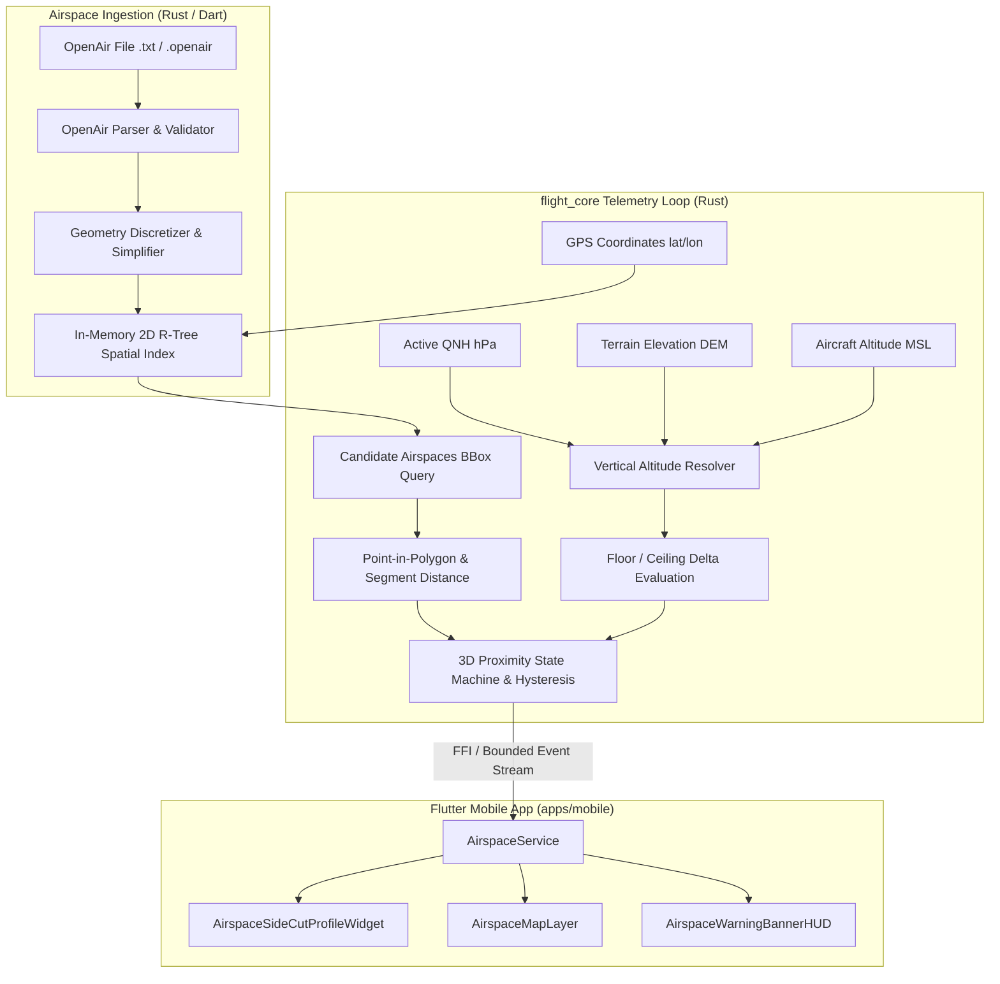

# OpenAir Airspace Parser and 3D Proximity Detection Architecture

## Context

Free-flight navigation demands low-latency, deterministic spatial checks. Airspaces are defined using the text-based OpenAir format, with mixed coordinate conventions (degrees-minutes-seconds, decimal degrees, relative circle/arc parameters) and diverse vertical datum specifications (Flight Levels referenced to standard $1013.25\text{ hPa}$, AGL heights above dynamic terrain, MSL barometric altitudes). Performing these evaluations at 10–20 Hz inside the Dart UI isolate creates garbage collection pressure and frame drops. Moving the spatial engine into `crates/flight_core` ensures deterministic computation, high efficiency, and zero UI thread interference.

## Decisions

### Decision 1: OpenAir Parser & Geometry Discretization (`crates/flight_core`)
The parser consumes OpenAir text line-by-line and compiles an Abstract Syntax Tree (AST):
- **Records**:
  - `AC <class>`: Class enum mapping (`A`, `B`, `C`, `D`, `E`, `F`, `G`, `CTR`, `P`, `R`, `D`, `W`, `GP`, `TMZ`, `RMZ`, `GliderSector`, `Other`).
  - `AN <name>`: Airspace name string.
  - `AH <ceiling>` / `AL <floor>`: Vertical limit string parsed into structured `VerticalLimit`:
    - `FlightLevel(u32)`
    - `FeetMsl(f64)`, `MetersMsl(f64)`
    - `FeetAgl(f64)`, `MetersAgl(f64)`
    - `Gnd`, `Sfc`, `Unlimited`
  - `DP <lat> <lon>`: Polygon vertices with flexible coordinate parsing (`DD:MM:SS N/S DDD:MM:SS E/W`, `DD:MM.MMM`, decimal degrees).
  - `V X=<lat> Y=<lon>` / `V D=+|-` / `DC <radius>` / `DA <radius>,<start>,<end>` / `DB <p1>,<p2>`: Arc and circle discretization:
    - Circle/arc parameters are discretized into polygon segments with angular step $\Delta \theta = 2 \arccos\left(1 - \frac{\epsilon}{R}\right)$, where chord tolerance $\epsilon \le 10\text{ m}$.

### Decision 2: Spatial Indexing & Euclidean Distance Computation
1. **2D R-Tree Spatial Indexing**:
   - Polygons are indexed in a 2D R-Tree based on their bounding boxes $[lat_{min}, lon_{min}, lat_{max}, lon_{max}]$.
   - Spatial candidate search queries the R-Tree for airspaces within a search radius (e.g. 15 km) around the aircraft.

2. **Equirectangular Projection for Local Metric Distances**:
   - For positions near $(\phi_0, \lambda_0)$, coordinates are projected onto local Cartesian coordinates:
     $$x = R_{\text{earth}} \cdot (\lambda - \lambda_0) \cdot \cos\left(\frac{\phi + \phi_0}{2}\right)$$
     $$y = R_{\text{earth}} \cdot (\phi - \phi_0)$$
     where $R_{\text{earth}} = 6371000\text{ m}$.
   - Exact shortest horizontal distance $d_H$ from aircraft point $P$ to polygon edges is calculated using point-to-line-segment distance projection.
   - Point-in-polygon classification uses ray-casting (Jordan curve theorem) with winding number verification for complex multi-ring geometries.

### Decision 3: Vertical Limit Resolution & QNH Conversion
1. **Flight Level (FL) Conversion**:
   - $FL$ is pressure altitude in hundreds of feet relative to the standard datum ($1013.25\text{ hPa}$).
   - Converted to absolute MSL altitude $h_{\text{MSL}}$ using active QNH:
     $$h_{\text{std}} = FL \cdot 100 \cdot 0.3048\text{ m}$$
     $$\Delta h_{\text{QNH}} = (QNH - 1013.25) \cdot 8.43\text{ m/hPa}$$
     $$h_{\text{MSL}} = h_{\text{std}} + \Delta h_{\text{QNH}}$$

2. **AGL (Above Ground Level) Conversion**:
   - $h_{\text{floor, MSL}} = h_{\text{terrain, MSL}} + (h_{\text{AGL}} \cdot 0.3048\text{ if ft else } 1.0)$.
   - If terrain DEM elevation is unavailable, fallback gracefully uses aircraft ground elevation or barometric ground reference with safety indicator.

### Decision 4: 3-Tier Alert State Machine & Hysteresis
The proximity state machine tracks per-airspace warning levels:
- **Level 1 (Advisory)**: $d_H < 1000\text{ m}$ OR $d_V < 150\text{ m}$.
- **Level 2 (Warning)**: $d_H < 500\text{ m}$ OR $d_V < 75\text{ m}$.
- **Level 3 (Violation)**: $d_H = 0$ (inside horizontal polygon) AND $h_{\text{floor}} \le h_{\text{aircraft}} \le h_{\text{ceiling}}$.
- **Hysteresis**:
  - Escalation occurs immediately on the first telemetry cycle meeting threshold criteria.
  - Downgrade/clearing requires separation to exceed threshold $+ 10\%$ ($d_H > 550\text{ m} / 1100\text{ m}$, $d_V > 82.5\text{ m} / 165\text{ m}$) sustained for at least 2 consecutive seconds.

### Decision 5: Side-Cut Profile Widget & Glide Slope Trajectory
- Widget draws a 2D vertical cross-section along the aircraft track azimuth $\theta_{\text{track}}$ up to a lookahead distance $D_{\text{max}} = 10\text{ km}$.
- Glider position is rendered at $x=0$, $z=h_{\text{aircraft}}$.
- Projected glide slope trajectory line:
  $$z(x) = h_{\text{aircraft}} - \frac{x}{L/D}$$
  where $L/D$ is the current instantaneous or smoothed glide ratio (clamped to $[3.0, 15.0]$).
- Intersecting airspaces along track $[0, D_{\text{max}}]$ are sliced to compute entry distance $x_{\text{entry}}$, exit distance $x_{\text{exit}}$, floor $z_{\text{floor}}(x)$, and ceiling $z_{\text{ceiling}}(x)$, rendered as semi-transparent colored polygons.
- Warning highlights trigger when the projected glide slope $z(x)$ penetrates an airspace block.

## Risks & Trade-offs

- **Large OpenAir File Memory Overhead**: Multi-megabyte airspace files with tens of thousands of vertices. Handled by indexing bounding boxes in R-Tree and storing vertex coordinates in contiguous flat vectors.
- **QNH Calibration Discrepancy**: If pilot enters incorrect QNH, FL airspace boundaries shift. Mitigated by auto-syncing QNH from nearby METAR / weather service or defaulting to standard atmosphere with clear UI indicator.
- **Arc Discretization Granularity**: Too coarse leads to false proximity alerts; too fine increases polygon vertex count. The $10\text{ m}$ chord tolerance bounds maximum error to sub-GPS accuracy levels.

## Migration Plan

1. Implement OpenAir parser, AST, and geometry compiler in `crates/flight_core`.
2. Build 2D R-Tree spatial indexing and 3D proximity state machine in `crates/flight_core`.
3. Expose C-FFI / Dart bindings in `plugins/brandyfly_native` and wrap in Dart `AirspaceService`.
4. Create UI Airspace Side-Cut Profile widget and map overlay in `apps/mobile`.
5. Validate against standard OpenAir fixtures and real-time flight replay scenarios.
